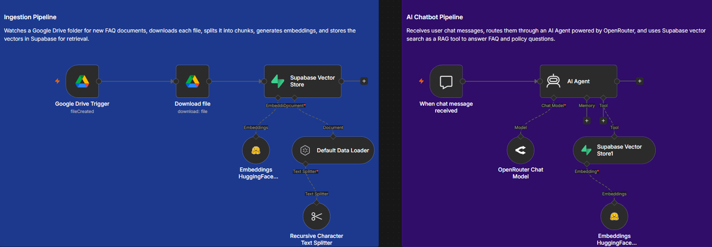

<div align="center">

# 🧠 n8n RAG Pipeline & AI Chatbot

**Turn your business documents into a 24/7 AI assistant — powered by your own private data.**

[](https://n8n.io)
[](https://supabase.com)
[](https://huggingface.co)
[](https://openrouter.ai)
[](https://drive.google.com)

*Retrieval-Augmented Generation (RAG) · Zero hallucinations · Always grounded in your data*

</div>

---

## 🏗️ Architecture Overview



> **Two pipelines, one workflow.** Documents flow in automatically from Google Drive and become searchable knowledge. Customer questions flow out through an AI agent that answers *only* from that knowledge.

---

## ⚙️ Technical Architecture

This project is a single, production-ready **n8n workflow** (`workflow.json`) composed of two tightly integrated pipelines. Together, they implement a complete **Retrieval-Augmented Generation (RAG)** system — no custom backend code required.

### 🔒 Security Notice

> **All credentials and API keys have been completely stripped from `workflow.json` for security.**
>
> The exported workflow contains **no** stored passwords, tokens, or secret keys. Placeholder values (e.g. `YOUR_GOOGLE_DRIVE_FOLDER_ID`) are used where configuration is required. After importing into n8n, you must connect your own credentials through n8n's secure credential manager — they are never committed to version control.

---

### 📥 Pipeline 1 — Ingestion Pipeline

**Purpose:** Automatically index new business documents so they become instantly searchable by the AI chatbot.

| Step | Component | Role |
|------|-----------|------|
| 1️⃣ | **Google Drive Trigger** | Watches a designated folder and fires when a new file is uploaded (polls every minute) |
| 2️⃣ | **Download File** | Retrieves the full document binary from Google Drive |
| 3️⃣ | **Default Data Loader** | Parses the downloaded file into processable text |
| 4️⃣ | **Recursive Character Text Splitter** | Splits text into overlapping chunks (200 tokens, 20-token overlap) for precise retrieval |
| 5️⃣ | **HuggingFace Inference Embeddings** | Converts each chunk into a high-dimensional vector representation |
| 6️⃣ | **Supabase Vector Store** *(insert mode)* | Persists embeddings into the `documents` table via the `match_documents` function |

```
📁 Google Drive (new file)
        │
        ▼
  ⬇️  Download
        │
        ▼
  ✂️  Chunk & Split
        │
        ▼
  🤗 HuggingFace Embeddings
        │
        ▼
  🗄️ Supabase Vector Store
```

**Key behavior:** Drop a PDF, Word doc, or text file into your watched Google Drive folder — within minutes it is chunked, embedded, and stored. No manual upload step. No developer intervention.

---

### 💬 Pipeline 2 — AI Chatbot Pipeline

**Purpose:** Receive user questions and return accurate, context-grounded answers using the indexed knowledge base.

| Step | Component | Role |
|------|-----------|------|
| 1️⃣ | **Chat Trigger** | Receives incoming user messages via n8n's built-in chat interface |
| 2️⃣ | **AI Agent** | Orchestrates reasoning, tool selection, and response generation |
| 3️⃣ | **OpenRouter Chat Model** *(DeepSeek v4 Flash)* | Powers the agent's language understanding and natural-language replies |
| 4️⃣ | **Supabase Vector Store** *(retrieve-as-tool mode)* | Searches the `documents` table and returns the most relevant chunks as context |
| 5️⃣ | **HuggingFace Inference Embeddings** | Embeds the user's query for semantic similarity search |

```
💬 User Message
        │
        ▼
  🤖 AI Agent (OpenRouter / DeepSeek)
        │
        ├──► 🔍 Supabase Vector Search (RAG tool)
        │           │
        │           ▼
        │     📄 Relevant document chunks
        │
        ▼
  ✅ Grounded, accurate reply
```

**Key behavior:** The AI Agent is instructed to **always query the Supabase vector store** before answering business-related questions. It is explicitly forbidden from inventing policies, prices, or features. If no relevant context is found, it politely escalates to a human — never guesses.

---

### 🧩 Technology Stack

| Layer | Technology | Why |
|-------|-----------|-----|
| **Orchestration** | [n8n](https://n8n.io) | Visual, no-code workflow automation with native LangChain nodes |
| **Document Source** | [Google Drive](https://drive.google.com) | Familiar upload interface for non-technical staff |
| **Embeddings** | [HuggingFace Inference API](https://huggingface.co/inference-api) | Cost-effective, high-quality vector embeddings |
| **Vector Database** | [Supabase](https://supabase.com) + pgvector | Managed Postgres with built-in vector similarity search |
| **Language Model** | [OpenRouter](https://openrouter.ai) → DeepSeek v4 Flash | Fast, capable, and cost-efficient LLM via a unified API |

---

### 🚀 Quick Start

1. **Import** `workflow.json` into your n8n instance (self-hosted or cloud).
2. **Configure credentials** in n8n for:
   - Google Drive OAuth2
   - HuggingFace Inference API
   - Supabase (URL + Service Role Key)
   - OpenRouter API Key
3. **Set** your Google Drive folder ID in the *Google Drive Trigger* node.
4. **Create** the `documents` table and `match_documents` function in Supabase (standard n8n RAG setup).
5. **Activate** the workflow — upload a document to your Drive folder and test via the n8n Chat interface.

---

## 💼 Real-World Business Value

> *You don't need to understand vectors, embeddings, or LLMs to benefit from this system. You just need documents and questions.*

This workflow transforms any collection of business documents into a **private, always-on AI assistant** that speaks in plain language — grounded entirely in *your* data, not the internet.

---

### 🏢 For Companies & HR Teams

**The problem:** Employees constantly interrupt HR and managers with the same questions — leave policies, expense rules, remote work guidelines, benefits enrollment, IT setup steps. Onboarding new hires means repeating the same explanations over and over.

**How this helps:**

| Scenario | Before | After |
|----------|--------|-------|
| *"How many vacation days do I get in year one?"* | Employee emails HR, waits hours or days | Instant answer from the employee handbook |
| *"What's the dress code for client meetings?"* | Manager gets pinged on Slack | Chatbot cites the official policy document |
| *"How do I submit an expense report?"* | New hire searches a shared drive for 20 minutes | Step-by-step answer pulled from the onboarding guide |

**Concrete example:** A 200-person company uploads its *Employee Handbook*, *IT Policy*, and *Benefits Guide* to a Google Drive folder. Within minutes, every section is indexed. New hires ask the chatbot questions on day one and get accurate answers immediately — HR saves dozens of hours per month.

---

### 🍽️ For Restaurants, E-commerce & Customer-Facing Businesses

**The problem:** Customers message you at all hours asking about menus, booking rules, delivery zones, return policies, and opening hours. Hiring enough staff to answer every message is expensive; ignoring them loses sales.

**How this helps:**

| Scenario | Before | After |
|----------|--------|-------|
| *"Are you open on public holidays?"* | Customer calls, gets voicemail | Chatbot answers instantly from the hours document |
| *"Do you deliver to Zone 3?"* | Staff manually checks a spreadsheet | Chatbot retrieves the delivery policy in seconds |
| *"Is the pasta dish gluten-free?"* | Waiter interrupted mid-service | Customer gets the answer from the menu FAQ, 24/7 |
| *"What's your return policy for sale items?"* | Support ticket queue grows overnight | Chatbot handles it before your team wakes up |

**Concrete example:** A restaurant uploads its *Menu*, *Reservation Policy*, and *Delivery FAQ* to Google Drive. Customers visiting the website chat widget ask *"Can I book a table for 8 people this Friday?"* — the bot answers using the actual booking rules document, not a guess.

---

### 🎯 The Ultimate Benefit

<div align="center">

| 💰 Save Time | 📉 Cut Support Costs | 🎯 Zero Hallucinations |
|:---:|:---:|:---:|
| Automate answers to repetitive questions that eat up staff hours every day | Reduce reliance on large support teams for FAQ-level inquiries | Answers come **only** from your private documents — the AI cannot invent policies, prices, or features |
| ⚡ Instant Responses | 🌙 24/7 Availability | 🔐 Your Data Stays Private |
| Sub-second retrieval from your knowledge base, not a support ticket queue | Customers and employees get help at 2 AM, on weekends, on holidays | Documents live in *your* Google Drive and *your* Supabase — never used to train public models |

</div>

**In one sentence:** *Upload your documents once. Answer every question forever — accurately, instantly, and without hiring another person.*

---

## 📂 Repository Contents

| File | Description |
|------|-------------|
| `workflow.json` | Complete n8n workflow (credentials stripped, safe to share) |
| `workflow-design.png` | Visual architecture diagram of both pipelines |
| `README.md` | This documentation |

---

## 📄 License

This project is provided as-is for educational and commercial use. Configure your own API accounts and respect each provider's terms of service.

---

<div align="center">

**Built with ❤️ using n8n · Supabase · HuggingFace · OpenRouter**

*Questions? Open an issue or adapt the workflow to your business needs.*

</div>
